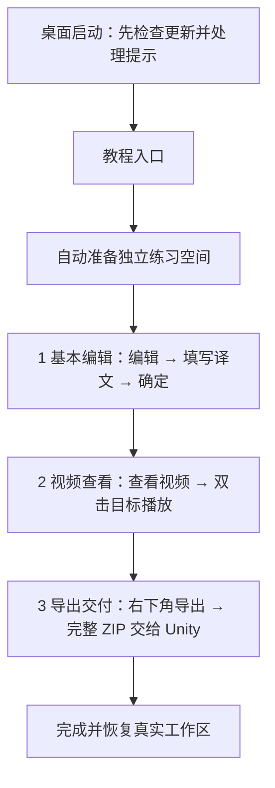

# 三步使用教程

教程只讲基本编辑、视频查看和导出交付。全程静音，使用目标旁的聚焦提示。

进入后自动载入一个任务、一句练习文本，默认勾选该任务。确认译文后自动进入视频查看；查看画面后点击下一步，最后完成导出交付演练。支持上一步、跳过编辑和退出。「关于 → 使用教程」可重新进入。

教程包、练习数据、备份和工作量保存到独立 IndexedDB `mida-localization-editor-tutorial`；桌面 WebView 也使用专属存储。真实 ZIP 不会导入教程空间，教程项目身份也被前端、Python 和 Rust 真实 ZIP 导入端拒绝。进入前保护保存真实工作区，退出后读取真实存档。

旧版长教程首次切换为三步教程时仅重建教程练习数据。重新练习同样只重置教程空间。真实任务、译文、媒体与备份保持不变。

教学视频没有音轨，教程内静音播放；单击目标定位暂停，双击目标直接打开并播放。交付使用真实保存与导出快照流程，仅演练，不生成业务 ZIP。正式工作将导出的完整 ZIP 交给 Unity 回收，无需解压，不回传视频。

首次启动先完成更新检测及提示，再展示教程入口；已有用户升级后也能进入。浏览器预览不安装桌面更新，更新安装需在桌面发行版本中验收。
